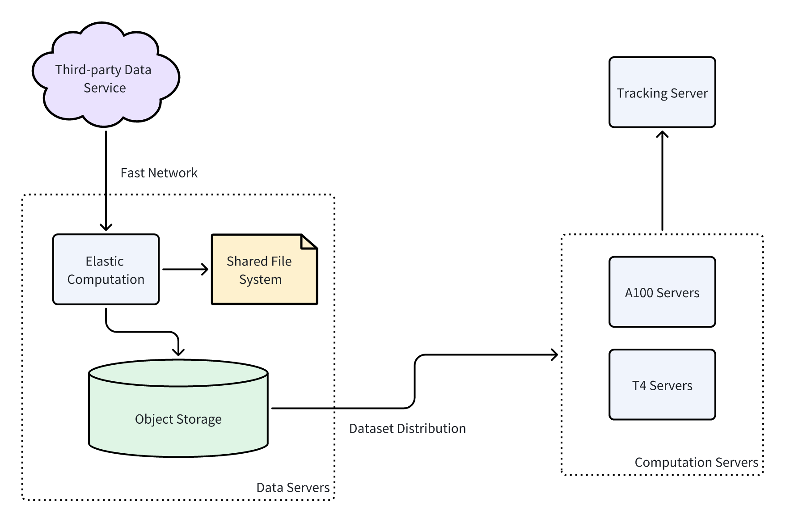

# Stock Statistical Arbitrage Demo


**_THIS REPO IS FOR DEMONSTRATION PURPOSES ONLY, CORE CODE HAS INTENTIONALLY BEEN REMOVED. DO NOT USE FOR COMMERCIAL PURPOSES._**

Minimal code for statistical arbitrage strategies on Chinese stock market:
* Lightweight data management: raw data is purely managed on local/shared file system & datasets can be easily made and distributed to wherever computation resources(GPU/TPU) are.



* Strategy-oriented design: project is organized by strategies. It makes code compact, maximizes reuse and is easy to extend.

* Idea->experiment->improvement: Through highly flexible config files and tracking utils, it is easy to conduct, compare and reproduce massive experiments, accelerating and the idea->experiment->improvement loop.

```yaml
model:
class_path: stock_statistical_arbitrage.strategy.base_nn.BaseModel
init_args:
    encoder:
        class_path: stock_statistical_arbitrage.nn.RNN
        init_args:
            cell_type: GRU
            channel_dim: 10
            model_dim: 32
            num_layers: 1
            bidirectional: True
            dropout: 0.1
    embedding: 
        class_path: stock_statistical_arbitrage.nn.EmbeddingMachine
        init_args:
            embedding_sizes:
                - 8192
                - 64
            embedding_dims:
                - 4
                - 4
    predictor:
        class_path: stock_statistical_arbitrage.nn.MLP
        init_args:
            layer_dims:
            - 72 # 32 * 2 + 4 + 4
            - 32
            - 1
            dropout: 0.1
    lr: 0.0001
    verbose: False
```


## Quick Start

* **File structure**:
```text
├── configs # folder for config files
│   ├── baseline_lightgbm.yaml
│   └── baseline_nn.yaml
├── pyproject.toml
├── README.md
└── stock_statistical_arbitrage
    ├── datayes.py
    ├── __init__.py
    ├── nn.py
    ├── strategy # folder for strategy instance
    │   ├── base_lightgbm.py
    │   ├── base_nn.py
    │   ├── __init__.py # template strategy
    └── utils.py
```

* **install**: `pip install -e .`
* **data management**: `python stock_statistical_arbitrage/datayes.py --help`
* **train & backtest**: `python stock_statistical_arbitrage/strategy/base_nn.py -c configs/baseline_nn.yaml`

